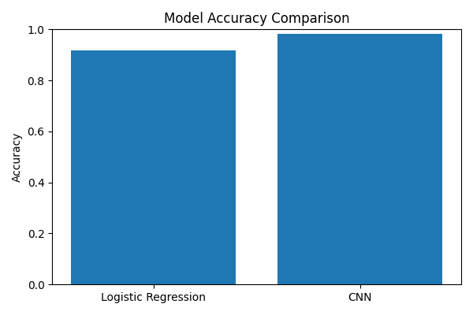
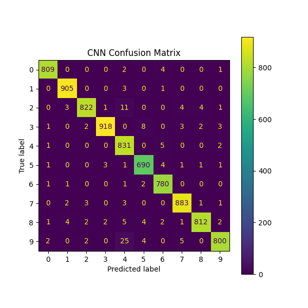
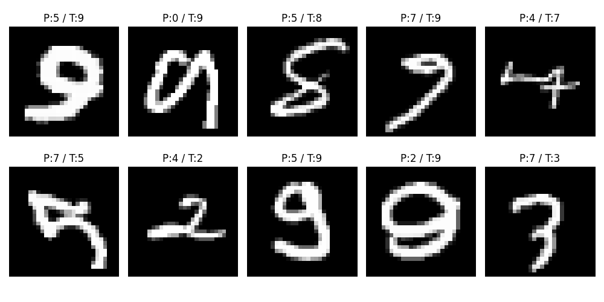
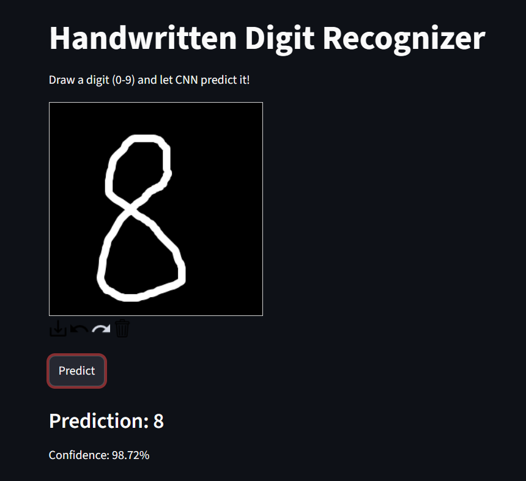

# Handwritten Digit Classification (MNIST)

> Comparison between classical machine learning and deep learning for handwritten digit recognition.

---

## Overview

This project compares different approaches for MNIST classification:

- Classical ML (Logistic Regression + PCA)
- Deep Learning (CNN)
- Interactive Streamlit drawing interface

Goal: analyze **feature engineering vs automatic feature learning**.

---

## Models

### Classical Machine Learning
- Logistic Regression
- PCA dimensionality reduction
- Hand-crafted feature pipeline

### Deep Learning
- Convolutional Neural Network (CNN)
- Automatic feature extraction
- End-to-end learning

### Interactive System
- Streamlit drawing canvas
- Real-time digit prediction
- CNN inference engine

---

## System Design

```
Streamlit UI
   ↓
Preprocessing Pipeline
   ↓
Model Selector (LR / CNN)
   ↓
Inference Engine
   ↓
Prediction Output
```

Key idea: **modular ML system design separating UI, training, and inference**.

---

## Results

### Accuracy Comparison


### CNN Confusion Matrix


### Misclassified Samples


---

## Interactive Demo

### Streamlit Handwritten Input


Features:
- Draw digit with mouse
- Real-time prediction
- CNN-based inference

---

## Methodology

### Classical ML Pipeline
- Image normalization
- PCA dimensionality reduction
- Linear classifier

### CNN Pipeline
- Convolution layers for feature extraction
- Pooling layers for spatial reduction
- Fully connected classification head

---

## Project Structure

```
ML-MINI-PROJECT/
│
├── app.py
├── main.py
├── requirements.txt
│
├── saved_model/
│   └── cnn_model.keras
│
├── data/
├── outputs/
│
└── src/
    ├── preprocess.py
    ├── train_lr.py
    ├── train_cnn.py
    ├── evaluate.py
    └── visualize.py
```

---

## Installation

```bash
pip install -r requirements.txt
```

---

##  Run Project

### Train Models
```bash
python main.py
```

### Launch Streamlit App
```bash
streamlit run app.py
```

---

## Key Concepts

- CNN learns hierarchical features automatically
- Classical ML relies on feature engineering
- PCA improves linear separability but has limits
- Deep learning achieves better generalization

---

## Future Work

- Improve CNN (BatchNorm, Dropout)
- Add advanced models (ResNet)
- Deploy Streamlit app online
- Add model comparison dashboard

---

## Author

Built by: Hubert Kuo  
Focus: Computer Vision / Machine Learning / AI Systems